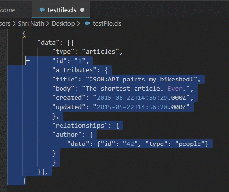

# 

> This tool helps you to convert your hard coded JSON into APEX JSON GENERATOR class code automatically. 

## Features

- To use this tool select you JSON in vscode. 

 

- Open Command Pallet usign `SHIFT+CTRL+P` and select `JASPEX: Create JSON Generator From Selected Text`. 

 

- If operation done successfully your APEX code will be copied on ClipBoard.

- Press CTRL+V to Paste it inside your code.

  
  
## For more information

- Github Repo : https://github.com/AyuSharma-dev/Jaspex_Vscode

**Enjoy!**
