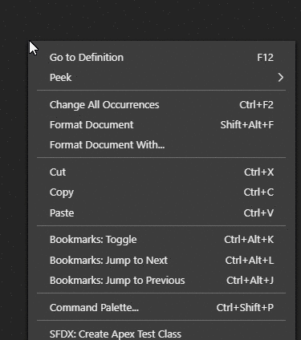
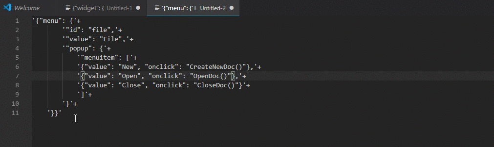

# 

> This tool helps you to convert your hard coded JSON into APEX JSON GENERATOR class code automatically. 

---

## How to use.

- To use this tool select you JSON in vscode. 

 

- Open Command Pallet usign `SHIFT+CTRL+P` and select `JASPEX: Create JSON Generator From Selected Text`. 

 

- If operation done successfully your APEX code will be copied on ClipBoard.

- Press CTRL+V to Paste it inside your code.

---
  
## Features

- Create Json generator object from Selected JSON.
- Creaet Json generator object from Copied JSON.
- Create Json generator object from Selected Quoted JSON.

>
    
>

- Create Json generator object from Copied Quoted JSON.

---

## Installation

- Visual Studio Market place : https://marketplace.visualstudio.com/items?itemName=AyuSharma-dev.jsontoapex

---

**Enjoy!**
